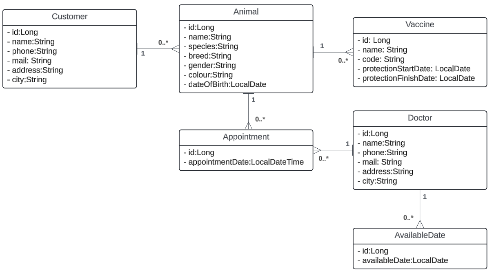

# 
Veterinary Clinic Management Application

## 
The application will be helper to management veterinary clinic services with recording datas about; animals, doctors, appointmens and much more you can learn more details about application by continue reading.

### Details of application:
- User can record animals which are came to clinic with owner of animal record. Thus user can store which animal brought by whom and if something need to change, user can make that.
- User can add doctors to database and create appointments based on available dates of doctors. After that user can make changes on that records.
- User can create records about vaccines which are applied to animals and it prevent to apply the same vaccine to an animal via controlling expiring dates.

### The technologies which are using by the application:
- Java 21
- Spring Boot
- Spring Data JPA
- PostgreSQL / MySQL
- Swagger
- IntelliJ IDEA

## Installation

Before you begin, ensure you have the following installed on your machine:

- **Java Development Kit (JDK) 21**: [Download and Install JDK](https://www.oracle.com/java/technologies/javase-jdk21-downloads.html)
- **Maven**: [Download and Install Maven](https://maven.apache.org/install.html)
- **PostgreSQL or MySQL**: [Download PostgreSQL](https://www.postgresql.org/download/) or [Download MySQL](https://dev.mysql.com/downloads/mysql/)
- **Git**: [Download and Install Git](https://git-scm.com/book/en/v2/Getting-Started-Installing-Git)
- **IntelliJ IDEA** (or another IDE): [Download IntelliJ IDEA](https://www.jetbrains.com/idea/download/)

### Clone

1. Clone the repository: `git clone https://github.com/BurcakOzturk/vetClinicApi.git`
2. Navigate to the project directory: `cd vetClinicApi`
3. Open the project in your IDE.

### Database Setup

1. Create a database named `vetClinic` in PostgreSQL or MySQL.
2. Update the database configuration in `src/main/resources/application.properties` with your database details.
3. Import the `vetClinicApi.sql` file to create the necessary tables and initial data.
4. Run the project.

## Database Design

The system uses a relational database with the following tables:

- `animals`: Stores animal information.
- `customers`: Stores customer information.
- `vaccines`: Stores vaccine information.
- `doctors`: Stores doctor information.
- `available_dates`: Stores doctor's available dates.
- `appointments`: Stores appointment details.

## API Documentation

The API documentation is provided using Swagger. You can access the Swagger UI to explore and test the API endpoints interactively.

- **Swagger UI:** [http://localhost:8080/swagger-ui.html](http://localhost:8080/swagger-ui.html)

Swagger provides a detailed description of each endpoint, including:
- **Functionality:** What each endpoint does.
- **Input Parameters:** Required and optional parameters for the endpoint.
- **Output:** The response format, including status codes and response body.

| Endpoint                                    | HTTP Method | Description                                                              |
|---------------------------------------------|-------------|--------------------------------------------------------------------------|
| **vaccine-controller**                      |             |                                                                          |
| /v1/vaccine                                 | GET         | Retrieves all vaccines                                                   |
| /v1/vaccine                                 | PUT         | Updates a vaccine                                                        |
| /v1/vaccine                                 | POST        | Adds a new vaccine                                                       |
| /v1/vaccine/{id}                            | GET         | Retrieves the vaccine with the specified ID                              |
| /v1/vaccine/{id}                            | DELETE      | Deletes the vaccine with the specified ID                                |
| /v1/vaccine/expiring                        | GET         | Retrieves vaccines that are expiring soon according to input date values |
| /v1/vaccine/animal/{id}                     | GET         | Retrieves vaccines for the specified animal ID                           |
|                                          |             |                                                                          |
| **doctor-controller**                       |             |                                                                          |
| /v1/doctor                                  | GET         | Retrieves all doctors                                                    |
| /v1/doctor                                  | PUT         | Updates a doctor                                                         |
| /v1/doctor                                  | POST        | Adds a new doctor                                                        |
| /v1/doctor/{id}                             | GET         | Retrieves the doctor with the specified ID                               |
| /v1/doctor/{id}                             | DELETE      | Deletes the doctor with the specified ID                                 |
|                                          |             |                                                                          |
| **customer-controller**                     |             |                                                                          |
| /v1/customer                                | GET         | Retrieves all customers                                                  |
| /v1/customer                                | PUT         | Updates a customer                                                       |
| /v1/customer                                | POST        | Adds a new customer                                                      |
| /v1/customer/{id}                           | GET         | Retrieves the customer with the specified ID                             |
| /v1/customer/{id}                           | DELETE      | Deletes the customer with the specified ID                               |
|                                          |             |                                                                          |
| **available-date-controller**               |             |                                                                          |
| /v1/availableDate                           | GET         | Retrieves all available dates                                            |
| /v1/availableDate                           | PUT         | Updates an available date                                                |
| /v1/availableDate                           | POST        | Adds a new available date                                                |
| /v1/availableDate/{id}                      | GET         | Retrieves the available date with the specified ID                       |
| /v1/availableDate/{id}                      | DELETE      | Deletes the available date with the specified ID                         |
|                                          |             |                                                                          |
| **appointment-controller**                  |             |                                                                          |
| /v1/appointment                             | GET         | Retrieves all appointments                                               |
| /v1/appointment                             | PUT         | Updates an appointment                                                   |
| /v1/appointment                             | POST        | Adds a new appointment                                                   |
| /v1/appointment/{id}                        | GET         | Retrieves the appointment with the specified ID                          |
| /v1/appointment/{id}                        | DELETE      | Deletes the appointment with the specified ID                            |
| /v1/appointment/appointmentsByDateAndDoctor | GET         | Retrieves appointments according to input date and doctor id values      |
| /v1/appointment/appointmentsByDateAndAnimal | GET         | Retrieves appointments according to input date and animal id values      |
|                                          |             |                                                                          |
| **animal-controller**                       |             |                                                                          |
| /v1/animal                                  | GET         | Retrieves all animals                                                    |
| /v1/animal                                  | PUT         | Updates an animal                                                        |
| /v1/animal                                  | POST        | Adds a new animal                                                        |
| /v1/animal/name/{animalName}                | GET         | Retrieves the animal by name                                             |
| /v1/animal/id/{id}                          | GET         | Retrieves the animal with the specified ID                               |
| /v1/animal/customer/{customerId}            | GET         | Retrieves animals with the specified customer ID                         |
| /v1/animal/{id}                             | DELETE      | Deletes the animal with the specified ID                                 |

## UML Diagram
A UML diagram illustrating the system architecture and relationships between entities is included below.

